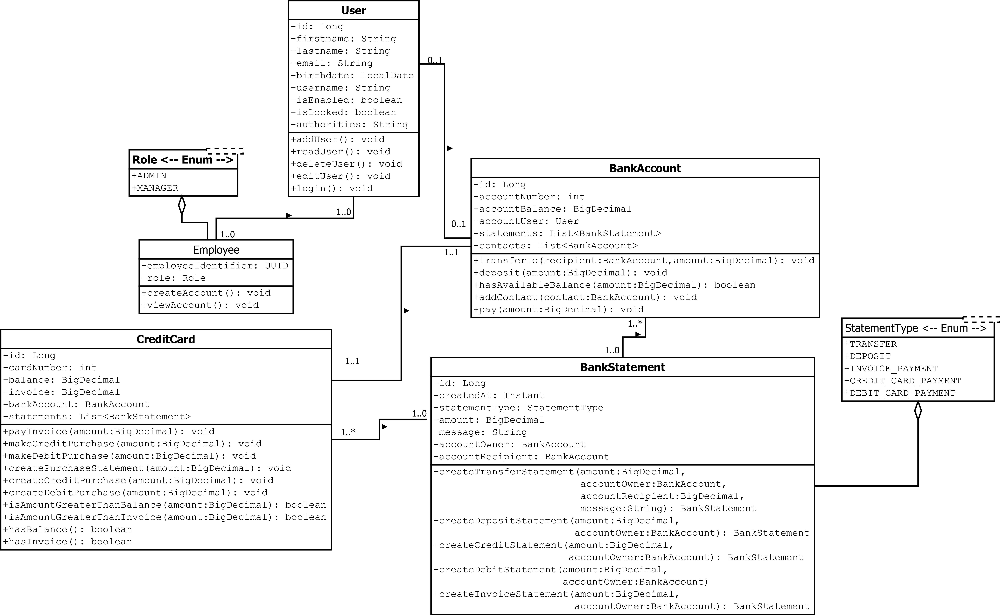

# Online Banking Application

## Actors

 - **ADMIN:** Should be able to access all the functionality of the system such as: Create an account, generate a credit/debit card, create a statement, view statements, create an invoice, deposit money, transfer money, balance enquiry and more.
 - **MANAGER:** Should be able to create an account, create statement, generate a credit/debit card, deposit money, transfer money.
 - **USER:** Should be able to create an account, generate a credit card, deposit money, transfer money, draw money, balance enquiry, view statements, pay invoice, make purchases, add contacts.

## Functional Requirements

### Essentials

- **Create an Account:** A user should be able to create an account by enter the data, a user should have only one account, the admin and the manager should be able to create an account for a user.
- **Generate a Credit Card:** A user should be able to generate a Credit Card after create an account in the system.
- **Deposit Money:** A user should be able to deposit money in the bank.
- **Transfer Money:** A user should be able to transfer money to another account.
- **Balance Enquiry:** A user should be able to see how much money they have in their accounts.
- **Draw Money:** A user should be able to take off their money from the bank.
- **Make Purchases:** A user should be able to make credit and debit purchases.

### Important

- **Create Statement:** The system should be able to create a statement after a user make a transaction.
- **View Statements:** The user should be able the statements of their bank account and credit card.
- **Create Invoice:** The system should be able to generate a credit card invoice.
- **Pay Invoice:** The user should be able to pay the credit card invoice.
- **Add Contacts:** The system after a transfer transaction should be able to add the account numbers in their both contacts list for a quick transfer in the next time.

## BBM BANK UML 
